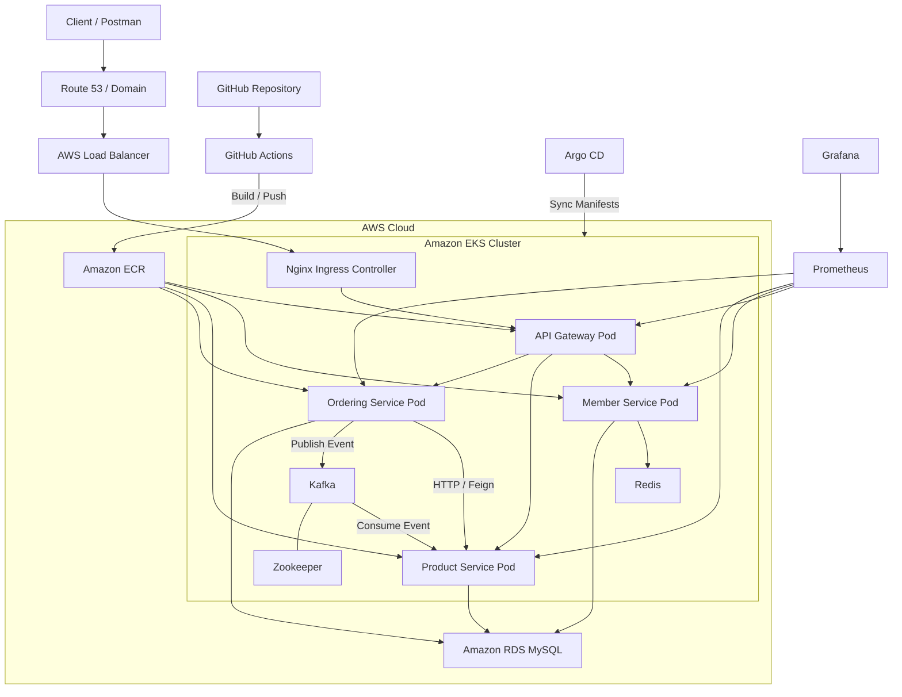

# Order MSA on Kubernetes

Spring Boot 기반의 주문 시스템을 MSA 형태로 구성한 프로젝트입니다. 회원, 상품, 주문 서비스를 분리하고, API Gateway, Kafka, Redis, Kubernetes, Argo CD, Prometheus, Grafana를 함께 적용했습니다.

## 프로젝트 소개

이 프로젝트는 주문 시스템을 마이크로서비스 아키텍처 형태로 구현한 예제입니다.

각 서비스는 다음 역할을 담당합니다.

- `member`: 회원가입, 로그인, Refresh Token 발급
- `product`: 상품 등록, 상품 조회, 재고 관리
- `ordering`: 주문 생성, 상품 서비스 연동, Kafka 기반 재고 차감 이벤트 발행
- `apigateway`: 외부 요청 진입점, JWT 검증 및 내부 서비스 라우팅

인프라 측면에서는 다음 구성을 포함합니다.

- `MySQL`: 서비스 데이터 저장
- `Redis`: Refresh Token 저장
- `Kafka`, `Zookeeper`: 비동기 이벤트 처리
- `Docker`: 서비스 이미지 빌드
- `Kubernetes`: 서비스 배포
- `Argo CD`: GitOps 배포
- `Prometheus`, `Grafana`: 모니터링
- `GitHub Actions`: CI/CD 자동화

## 기술 스택

### Backend
- Java 17
- Spring Boot 3
- Spring Web
- Spring Data JPA
- Spring Validation
- Spring Cloud Gateway
- Spring Cloud OpenFeign
- Spring Kafka
- Spring Data Redis
- Spring Boot Actuator
- JWT

### Infra / DevOps
- Docker
- Kubernetes
- AWS EKS
- AWS ECR
- Argo CD
- GitHub Actions
- Prometheus
- Grafana
- HPA
- Cluster Autoscaler
- Nginx Ingress

### Database / Messaging
- MySQL
- Redis
- Kafka
- Zookeeper

### Tools
- Git
- GitHub
- Postman
- PowerShell

## 한 번에 실행 순서

### 로컬 실행 순서

```text
MySQL 실행
-> Redis 실행
-> Zookeeper 실행
-> Kafka 실행
-> member 실행
-> product 실행
-> ordering 실행
-> apigateway 실행
-> Postman 테스트
```

### Kubernetes 실행 순서

```text
namespace 생성
-> Secret 생성
-> Zookeeper / Kafka / Redis 배포
-> member / product / ordering / apigateway 배포
-> Ingress 적용
-> HPA 적용
-> Monitoring 적용
-> Argo CD 연동
```

## 빠른 실행 명령어

아래 명령어는 모두 Windows PowerShell 기준입니다.

### 1. 로컬 실행

#### member
```powershell
Set-Location .\msa\member
.\gradlew.bat bootRun --args="--spring.profiles.active=local"
```

#### product
```powershell
Set-Location .\msa\product
.\gradlew.bat bootRun --args="--spring.profiles.active=local"
```

#### ordering
```powershell
Set-Location .\msa\ordering
.\gradlew.bat bootRun --args="--spring.profiles.active=local"
```

#### apigateway
```powershell
Set-Location .\msa\apigateway
.\gradlew.bat bootRun
```

### 2. Docker 이미지 빌드

#### member
```powershell
Set-Location .\msa\member
docker build -t member-service:local .
```

#### product
```powershell
Set-Location .\msa\product
docker build -t product-service:local .
```

#### ordering
```powershell
Set-Location .\msa\ordering
docker build -t ordering-service:local .
```

#### apigateway
```powershell
Set-Location .\msa\apigateway
docker build -t apigateway:local .
```

### 3. Kubernetes 배포

#### namespace 생성
```powershell
kubectl create namespace soldesk
```

#### DB Secret 생성
```powershell
kubectl create secret generic my-app-secrets `
  --from-literal=DB_HOST=YOUR_MYSQL_HOST `
  --from-literal=DB_PW=YOUR_MYSQL_PASSWORD `
  -n soldesk
```

#### 공용 서비스 배포
```powershell
kubectl apply -f .\msa\k8s\k8s-services\zookeeper.yml
kubectl apply -f .\msa\k8s\k8s-services\kafka.yml
kubectl apply -f .\msa\k8s\k8s-services\redis.yml
kubectl apply -f .\msa\k8s\k8s-services\ingress.yml
```

#### 마이크로서비스 배포
```powershell
kubectl apply -f .\msa\member\k8s\depl_svc.yml
kubectl apply -f .\msa\product\k8s\depl_svc.yml
kubectl apply -f .\msa\ordering\k8s\depl_svc.yml
kubectl apply -f .\msa\apigateway\k8s\depl_svc.yml
```

#### HPA 적용
```powershell
kubectl apply -f .\msa\k8s\k8s-hpa\member-hpa.yml
kubectl apply -f .\msa\k8s\k8s-hpa\product-hpa.yml
kubectl apply -f .\msa\k8s\k8s-hpa\ordering-hpa.yml
kubectl apply -f .\msa\k8s\k8s-hpa\apigateway-hpa.yml
```

#### 모니터링 적용
```powershell
Get-ChildItem .\msa\k8s\k8s-monitoring\*.yml | ForEach-Object { kubectl apply -f $_.FullName }
```

#### Argo CD Root App 적용
```powershell
kubectl apply -f .\argocd\root-app.yml
```

## 프로젝트 구조

```text
.
├─ .github
│  └─ workflows
├─ argocd
│  ├─ root-app.yml
│  └─ apps
├─ msa
│  ├─ apigateway
│  ├─ member
│  ├─ ordering
│  ├─ product
│  └─ k8s
│     ├─ k8s-services
│     ├─ k8s-hpa
│     ├─ k8s-monitoring
│     ├─ k8s-argocd
│     └─ autoscaler
```

주요 디렉터리는 아래와 같습니다.

- `msa/apigateway`: API Gateway
- `msa/member`: 회원 서비스
- `msa/product`: 상품 서비스
- `msa/ordering`: 주문 서비스
- `msa/k8s/k8s-services`: Kafka, Redis, Zookeeper, Ingress 등 공용 리소스
- `msa/k8s/k8s-hpa`: 서비스별 HPA 설정
- `msa/k8s/k8s-monitoring`: Prometheus, Grafana 설정
- `argocd/root-app.yml`: Argo CD App of Apps 진입점
- `argocd/apps`: 개별 Argo CD Application 정의

## 서비스 구조

### 전체 요청 흐름

1. 클라이언트가 `apigateway`로 요청을 보냅니다.
2. `apigateway`가 JWT를 검증합니다.
3. 요청을 `member`, `product`, `ordering` 서비스 중 해당 서비스로 전달합니다.
4. 주문 생성 시 `ordering` 서비스가 `product` 서비스에서 상품 정보를 조회합니다.
5. 주문 생성 후 `ordering` 서비스가 Kafka로 재고 차감 이벤트를 발행합니다.
6. `product` 서비스가 Kafka 이벤트를 소비하여 재고를 차감합니다.

### 서비스 간 의존 관계

- `apigateway` -> `member`, `product`, `ordering`
- `member` -> `Redis`
- `ordering` -> `product`
- `ordering` -> `Kafka`
- `product` -> `Kafka Consumer`
- `member`, `product`, `ordering` -> `MySQL`

### 아키텍처 다이어그램



## 사전 준비

실행 전 아래 항목이 필요합니다.

- Java 17
- Docker
- Kubernetes 클러스터
- kubectl
- MySQL
- Redis
- Kafka
- Zookeeper
- Git

AWS 환경까지 함께 사용할 경우 아래도 필요합니다.

- AWS CLI
- EKS Cluster
- ECR Repository
- Argo CD가 설치된 Kubernetes 환경

## 로컬 실행 참고 사항

- `member`, `product`, `ordering`는 `application-local.yml`을 사용할 수 있습니다.
- `apigateway`는 Kubernetes 서비스명을 기준으로 동작하는 설정이 포함되어 있을 수 있어, 로컬 실행 시에는 라우팅 URI를 로컬 환경에 맞게 조정해야 할 수 있습니다.
- 현재 프로젝트는 로컬 단독 실행보다 Kubernetes 기반 실행에 더 적합한 구조입니다.

## Postman 테스트 예시

기본 흐름은 회원가입 -> 로그인 -> 상품 등록 -> 상품 조회 -> 주문 생성 순서입니다.

### 1. 회원가입

**Request**

```http
POST /member/create
Content-Type: application/json
```

```json
{
  "name": "test-user",
  "email": "test1@example.com",
  "password": "1234"
}
```

**Response 예시**

```json
1
```

### 2. 로그인

**Request**

```http
POST /member/doLogin
Content-Type: application/json
```

```json
{
  "email": "test1@example.com",
  "password": "1234"
}
```

**Response 예시**

```json
{
  "id": 1,
  "token": "eyJhbGciOi...",
  "refreshToken": "eyJhbGciOi..."
}
```

### 3. 상품 등록

**Request**

```http
POST /product/create
Authorization: Bearer {token}
Content-Type: application/json
```

```json
{
  "name": "keyboard",
  "price": 50000,
  "stockQuantity": 20
}
```

**Response 예시**

```json
1
```

### 4. 상품 조회

**Request**

```http
GET /product/1
Authorization: Bearer {token}
```

**Response 예시**

```json
{
  "id": 1,
  "name": "keyboard",
  "price": 50000,
  "stockQuantity": 20
}
```

### 5. 주문 생성

**Request**

```http
POST /ordering/create
Authorization: Bearer {token}
Content-Type: application/json
```

```json
{
  "productId": 1,
  "productCount": 2
}
```

**Response 예시**

```json
1
```

### Authorization Header 예시

```text
Authorization: Bearer {token}
```

## CI/CD

GitHub Actions 워크플로는 `main` 브랜치 push 시 동작합니다.

주요 동작은 아래와 같습니다.

- 변경된 서비스 감지
- Docker 이미지 빌드
- ECR Push
- Kubernetes 배포 반영

워크플로 파일 위치:

- `.github/workflows/deploy_ordermsa_with_k8s.yml`

## 모니터링

각 서비스는 Prometheus 수집을 위한 annotation과 actuator endpoint 설정을 포함하고 있습니다.

구성 요소는 다음과 같습니다.

- Prometheus
- Grafana
- node-exporter

모니터링 관련 매니페스트는 `msa/k8s/k8s-monitoring` 경로에 위치합니다.

## 주의사항

현재 프로젝트는 학습 및 포트폴리오 목적의 MSA 예제입니다. 실제 운영 환경으로 확장하려면 아래 보완이 필요합니다.

- 서비스별 DB 분리
- 운영 프로필에서 `ddl-auto` 정책 개선
- 인증/인가 강화
- 주문-재고 간 데이터 정합성 개선
- 테스트 코드 보강
- 이미지 버전 태깅 전략 개선
- Argo CD와 GitHub Actions의 배포 역할 정리

## 한 줄 소개

Spring Boot 기반 주문 시스템을 MSA 구조로 분리하고, JWT 인증, Kafka 이벤트 처리, Redis 토큰 저장, Kubernetes 배포, Argo CD GitOps, Prometheus/Grafana 모니터링을 적용한 프로젝트입니다.
